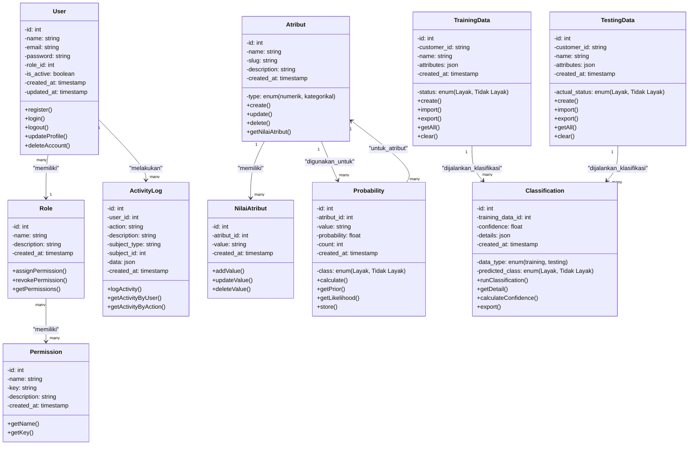
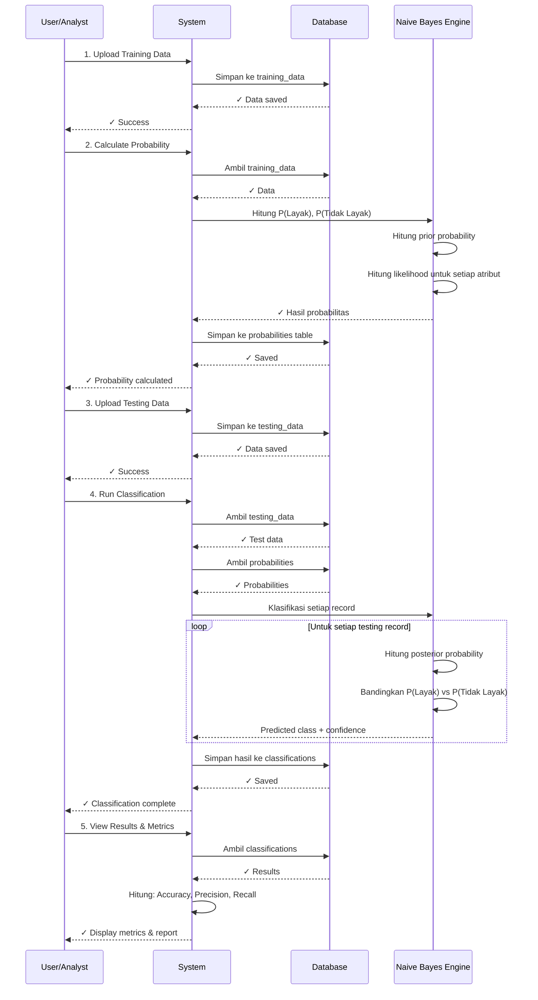
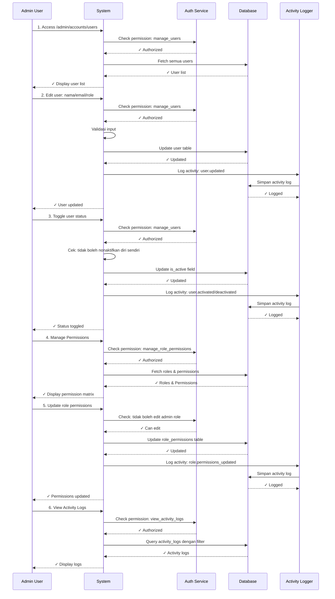
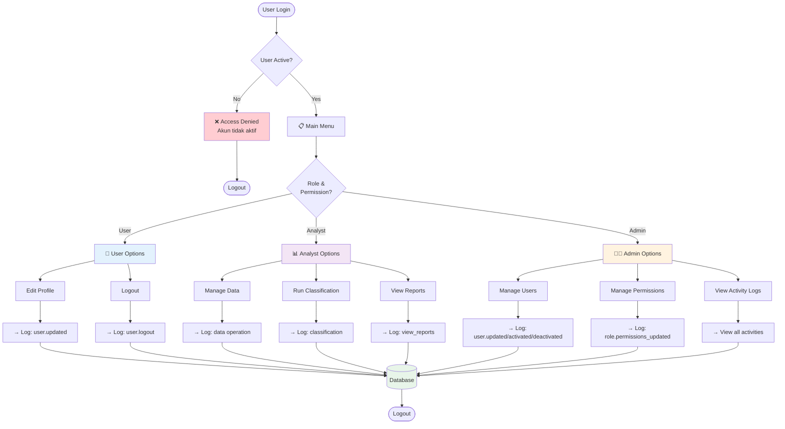
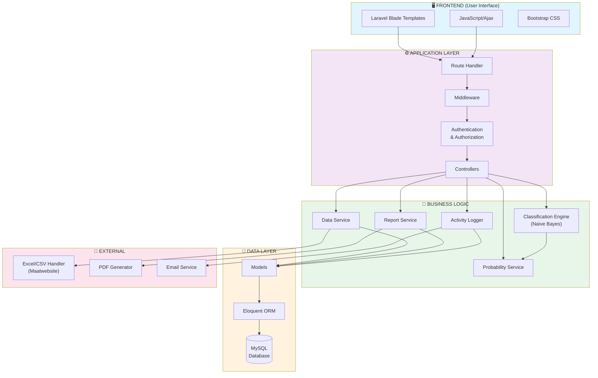
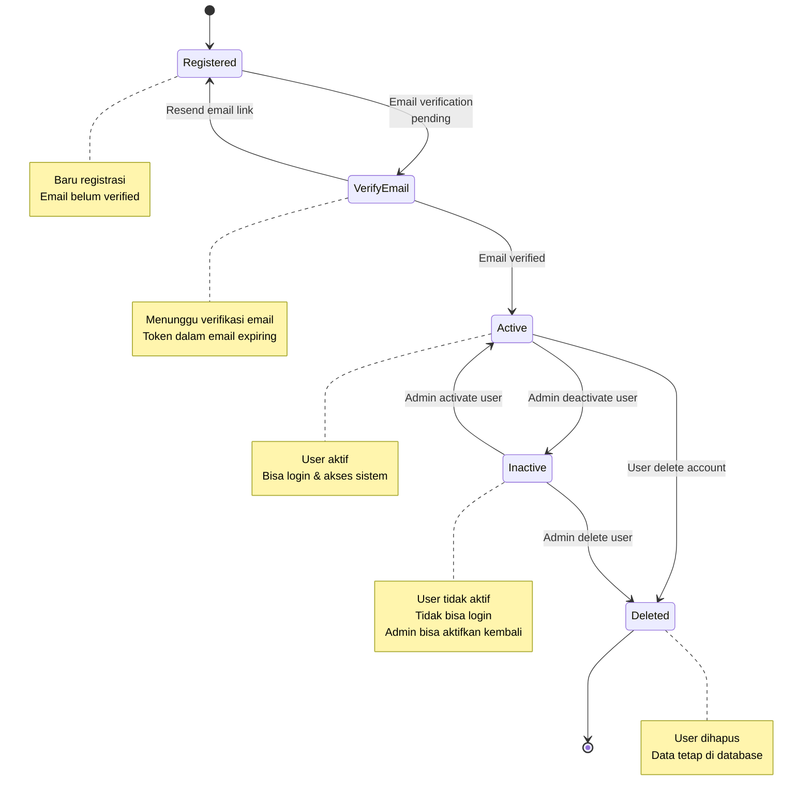
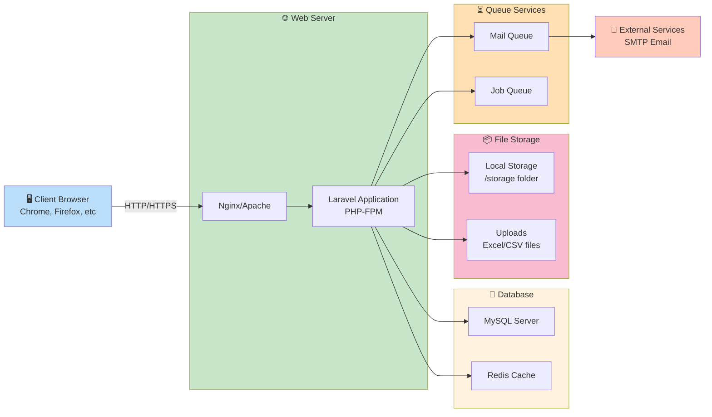

# UML Diagrams - Sistem Klasifikasi Penerima Bantuan Subsidi Listrik

---

## 1. CLASS DIAGRAM (Database Models & Relationships)



---

## 2. USE CASE DIAGRAM (Fitur & Aktor)

```mermaid
graph TB
    subgraph Users["👥 USERS"]
        Admin["Admin"]
        Analyst["Data Analyst"]
        Operator["Data Operator"]
    end

    subgraph Auth["🔐 AUTHENTICATION"]
        UC1["Register"]
        UC2["Login"]
        UC3["Logout"]
        UC4["Reset Password"]
    end

    subgraph AdminFeatures["👨‍💼 ADMIN FEATURES"]
        UC5["Manage Users"]
        UC6["Manage Roles & Permissions"]
        UC7["View Activity Logs"]
        UC8["Toggle User Status"]
        UC9["Edit User Data"]
    end

    subgraph DataMgmt["📊 DATA MANAGEMENT"]
        UC10["Manage Attributes"]
        UC11["Input Training Data"]
        UC12["Import Training Data"]
        UC13["Input Testing Data"]
        UC14["Import Testing Data"]
        UC15["Export Data"]
        UC16["Clear Data"]
    end

    subgraph Classification["🤖 CLASSIFICATION"]
        UC17["Calculate Probability"]
        UC18["Run Classification"]
        UC19["View Classification Results"]
        UC20["View Classification Details"]
        UC21["Reset Classification"]
    end

    subgraph Reports["📈 REPORTS"]
        UC22["View Performance Metrics"]
        UC23["View Classification Report"]
        UC24["Export Report CSV"]
        UC25["Export Report Excel"]
        UC26["Export Report PDF"]
    end

    subgraph Profile["👤 USER PROFILE"]
        UC27["View Profile"]
        UC28["Edit Profile"]
        UC29["Delete Account"]
    end

    subgraph Security["🔒 SECURITY"]
        UC30["Permission Check"]
        UC31["Activity Logging"]
        UC32["User Status Control"]
    end

    Admin --> UC5
    Admin --> UC6
    Admin --> UC7
    Admin --> UC8
    Admin --> UC9
    Admin --> UC30
    
    Analyst --> UC1
    Analyst --> UC2
    Analyst --> UC3
    Analyst --> UC4
    Analyst --> UC10
    Analyst --> UC11
    Analyst --> UC12
    Analyst --> UC13
    Analyst --> UC14
    Analyst --> UC15
    Analyst --> UC16
    Analyst --> UC17
    Analyst --> UC18
    Analyst --> UC19
    Analyst --> UC20
    Analyst --> UC21
    Analyst --> UC22
    Analyst --> UC23
    Analyst --> UC24
    Analyst --> UC25
    Analyst --> UC26
    Analyst --> UC27
    Analyst --> UC28
    Analyst --> UC29
    
    Operator --> UC1
    Operator --> UC2
    Operator --> UC3
    Operator --> UC4
    Operator --> UC11
    Operator --> UC12
    Operator --> UC13
    Operator --> UC14
    Operator --> UC15
    Operator --> UC27
    Operator --> UC28

    style Auth fill:#e1f5ff
    style AdminFeatures fill:#fff3e0
    style DataMgmt fill:#f3e5f5
    style Classification fill:#e8f5e9
    style Reports fill:#fce4ec
    style Profile fill:#f1f8e9
    style Security fill:#ffe0b2

```



---

## 3. ENTITY RELATIONSHIP DIAGRAM (Database Schema)

```mermaid
erDiagram
    USERS ||--o{ ROLES : "belongs_to"
    USERS ||--o{ ACTIVITY_LOGS : "has_many"
    USERS ||--o{ CLASSIFICATIONS : "created_by"
    
    ROLES ||--o{ PERMISSIONS : "has_many"
    ROLES ||--o{ ROLE_PERMISSIONS : "has_many"
    PERMISSIONS ||--o{ ROLE_PERMISSIONS : "has_many"
    
    ATTRIBUTES ||--o{ NILAI_ATTRIBUTES : "has_many"
    ATTRIBUTES ||--o{ PROBABILITIES : "has_many"
    
    TRAINING_DATA ||--o{ CLASSIFICATIONS : "has_many"
    TESTING_DATA ||--o{ CLASSIFICATIONS : "has_many"
    
    PROBABILITIES }o--|| ATTRIBUTES : "for_attribute"

    USERS {
        int id PK
        string name
        string email UK
        string password
        int role_id FK
        boolean is_active
        timestamp created_at
        timestamp updated_at
    }

    ROLES {
        int id PK
        string name
        string description
        timestamp created_at
    }

    PERMISSIONS {
        int id PK
        string name
        string key UK
        string description
        timestamp created_at
    }

    ROLE_PERMISSIONS {
        int role_id FK PK
        int permission_id FK PK
    }

    ACTIVITY_LOGS {
        int id PK
        int user_id FK
        string action
        string description
        string subject_type
        int subject_id
        json data
        timestamp created_at
    }

    ATTRIBUTES {
        int id PK
        string name UK
        string slug UK
        enum type
        string description
        timestamp created_at
    }

    NILAI_ATTRIBUTES {
        int id PK
        int atribut_id FK
        string value
        timestamp created_at
    }

    TRAINING_DATA {
        int id PK
        string customer_id UK
        string name
        json attributes
        enum status
        timestamp created_at
    }

    TESTING_DATA {
        int id PK
        string customer_id UK
        string name
        json attributes
        enum actual_status
        timestamp created_at
    }

    CLASSIFICATIONS {
        int id PK
        int training_data_id FK
        int testing_data_id FK
        enum data_type
        enum predicted_class
        float confidence
        json details
        timestamp created_at
    }

    PROBABILITIES {
        int id PK
        int atribut_id FK
        string value
        enum class
        float probability
        int count
        timestamp created_at
    }

```

---

## 4. SEQUENCE DIAGRAM - Proses Classification



---

## 5. SEQUENCE DIAGRAM - Admin User Management



---

## 6. ACTIVITY FLOW DIAGRAM



---

## 7. NAIVE BAYES CLASSIFICATION FLOW

```mermaid
graph LR
    Start([Training Data]) --> Step1["Step 1: Hitung Prior Probability<br/>P(Layak) = Jumlah Layak / Total<br/>P(Tidak Layak) = Jumlah Tidak Layak / Total"]
    
    Step1 --> Step2["Step 2: Hitung Likelihood<br/>untuk setiap atribut nilai"]
    
    Step2 --> Step3["Step 3: Simpan hasil ke<br/>Probability Table"]
    
    Step3 --> TestStart([Testing Data])
    
    TestStart --> Step4["Step 4: Ambil test record"]
    
    Step4 --> Step5["Step 5: Hitung Posterior<br/>P(Layak|X) = P(X|Layak) × P(Layak)<br/>P(Tidak Layak|X) = P(X|Tidak Layak) × P(Tidak Layak)"]
    
    Step5 --> Step6{"Posterior<br/>Layak > Tidak Layak?"}
    
    Step6 -->|Yes| Predict1["Prediksi: LAYAK<br/>Confidence: % nilai Layak"]
    Step6 -->|No| Predict2["Prediksi: TIDAK LAYAK<br/>Confidence: % nilai Tidak Layak"]
    
    Predict1 --> Save["Simpan ke Classification Table"]
    Predict2 --> Save
    
    Save --> NextRec{"Record<br/>selanjutnya?"}
    NextRec -->|Yes| Step4
    NextRec -->|No| Calculate["Hitung Metrik Performa:<br/>Accuracy, Precision, Recall"]
    
    Calculate --> Report["Generate Report"]
    
    Report --> End([Done])
    
    style Start fill:#c8e6c9
    style TestStart fill:#c8e6c9
    style Predict1 fill:#bbdefb
    style Predict2 fill:#ffccbc
    style Calculate fill:#f8bbd0
    style Report fill:#ffe0b2
    style End fill:#c8e6c9

```



---

## 8. SYSTEM ARCHITECTURE DIAGRAM



---

## 9. STATE DIAGRAM - User Status



---

## 10. DEPLOYMENT ARCHITECTURE



---

## Legenda & Notasi

### Hubungan Dalam Class Diagram
- `"1" --> "many"` : One-to-Many relationship
- `"many" --> "many"` : Many-to-Many relationship
- `"many" --> "1"` : Many-to-One relationship

### Entity Relationship Diagram
- `PK` : Primary Key
- `FK` : Foreign Key
- `UK` : Unique Key

### Use Case Symbols
- 👥 : User/Actor
- 🔐 : Authentication features
- 👨‍💼 : Admin features
- 📊 : Data management
- 🤖 : Classification features
- 📈 : Reports
- 👤 : User profile
- 🔒 : Security

---

## Ringkasan Diagram

| Diagram | Tujuan | Fokus |
|---------|--------|-------|
| Class Diagram | Struktur models & relationships | OOP structure, inheritance, associations |
| Use Case Diagram | Fitur & interaksi pengguna | Actors, use cases, system scope |
| ER Diagram | Struktur database | Tables, fields, constraints, keys |
| Sequence Diagram | Alur proses | Interaction antar komponen over time |
| Activity Flow | Alur aktivitas user | User journey, decision points |
| Classification Flow | Algoritma Naive Bayes | Step-by-step calculation process |
| System Architecture | Komponen sistem | Layers, modules, dependencies |
| State Diagram | Status user | State transitions, conditions |
| Deployment Architecture | Infrastructure | Hardware, servers, services |

---

*Diagram ini dibuat untuk dokumentasi sistem Klasifikasi Penerima Bantuan Subsidi Listrik menggunakan Naive Bayes*
