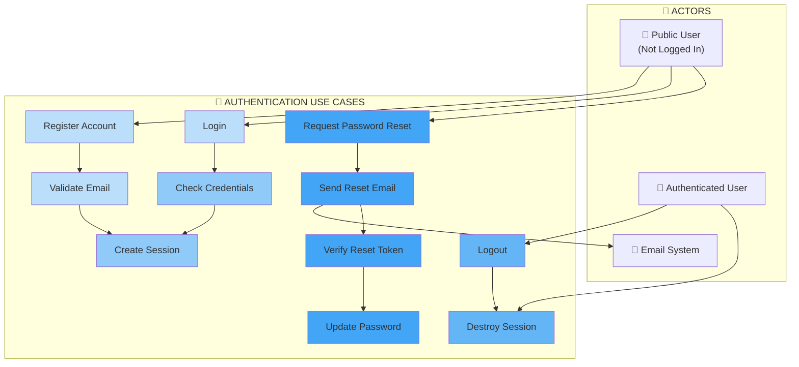
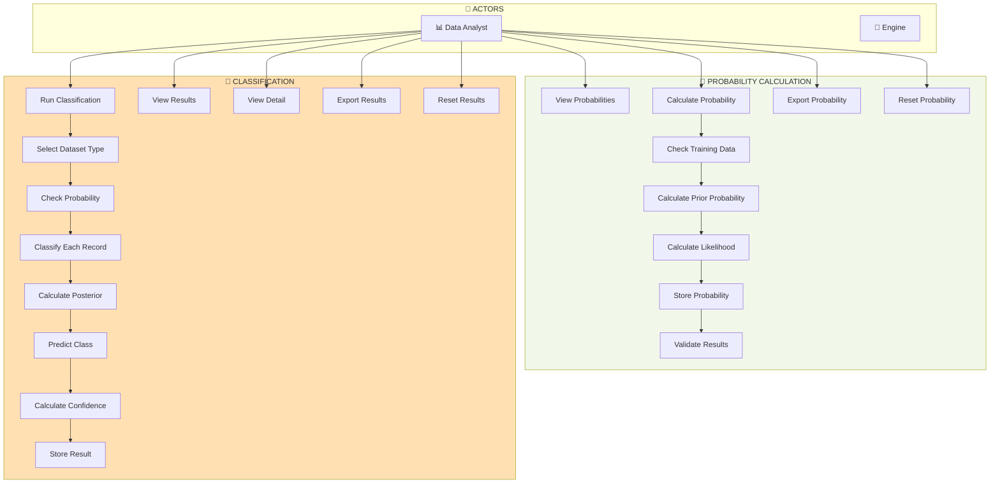
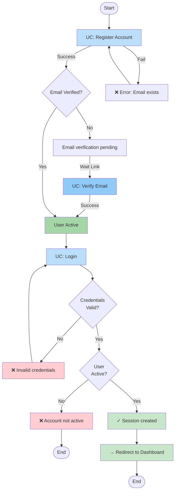
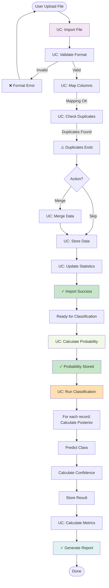

# USE CASE DIAGRAM - Sistem Klasifikasi Penerima Bantuan Subsidi Listrik

---

## 1. USE CASE DIAGRAM - OVERVIEW (Seluruh Sistem)

```mermaid
graph TB
    subgraph Actor["👥 ACTORS/PENGGUNA"]
        Admin["👨‍💼 Admin"]
        Analyst["📊 Data Analyst"]
        Operator["⚙️ Data Operator"]
        System["🤖 System"]
    end

    subgraph UC_Auth["🔐 AUTHENTICATION & AUTHORIZATION"]
        UC_Register["Register Account"]
        UC_Login["Login"]
        UC_ForgotPass["Reset Password"]
        UC_Logout["Logout"]
        UC_ViewProfile["View Profile"]
        UC_EditProfile["Edit Profile"]
        UC_DeleteAccount["Delete Account"]
        UC_CheckPermission["Check Permission"]
    end

    subgraph UC_Admin["👨‍💼 ADMIN MANAGEMENT"]
        UC_ManageUsers["Manage Users"]
        UC_ListUsers["View User List"]
        UC_EditUser["Edit User Data"]
        UC_ToggleStatus["Toggle User Status"]
        UC_ManageRoles["Manage Roles & Permissions"]
        UC_UpdatePermissions["Update Role Permissions"]
        UC_ViewActivityLogs["View Activity Logs"]
        UC_SearchLogs["Search Activity Logs"]
    end

    subgraph UC_Attributes["🏷️ ATTRIBUTE MANAGEMENT"]
        UC_ManageAttr["Manage Attributes"]
        UC_AddAttr["Add Attribute"]
        UC_EditAttr["Edit Attribute"]
        UC_DeleteAttr["Delete Attribute"]
        UC_ManageValues["Manage Attribute Values"]
        UC_AddValue["Add Value"]
        UC_EditValue["Edit Value"]
        UC_DeleteValue["Delete Value"]
    end

    subgraph UC_Training["📚 TRAINING DATA MANAGEMENT"]
        UC_TrainInput["Input Training Data"]
        UC_TrainManual["Add Manual Data"]
        UC_TrainImport["Import from File"]
        UC_TrainView["View Training Data"]
        UC_TrainExport["Export Training Data"]
        UC_TrainClear["Clear Training Data"]
        UC_TrainCount["View Data Statistics"]
    end

    subgraph UC_Testing["🧪 TESTING DATA MANAGEMENT"]
        UC_TestInput["Input Testing Data"]
        UC_TestManual["Add Manual Data"]
        UC_TestImport["Import from File"]
        UC_TestView["View Testing Data"]
        UC_TestExport["Export Testing Data"]
        UC_TestClear["Clear Testing Data"]
        UC_TestCount["View Data Statistics"]
    end

    subgraph UC_Probability["🎲 PROBABILITY CALCULATION"]
        UC_CalcProb["Calculate Probability"]
        UC_ViewProb["View Probability Results"]
        UC_ResetProb["Reset Probability"]
        UC_ExportProb["Export Probability"]
    end

    subgraph UC_Class["🤖 CLASSIFICATION"]
        UC_RunClass["Run Classification"]
        UC_ViewClass["View Classification Results"]
        UC_ClassDetail["View Classification Detail"]
        UC_ExportClass["Export Classification Results"]
        UC_ResetClass["Reset Classification"]
    end

    subgraph UC_Reports["📊 REPORTS & ANALYTICS"]
        UC_ViewMetrics["View Performance Metrics"]
        UC_ConfMatrix["View Confusion Matrix"]
        UC_Accuracy["View Accuracy"]
        UC_Precision["View Precision"]
        UC_Recall["View Recall"]
        UC_DetailReport["View Detailed Report"]
        UC_ExportReport["Export Report"]
        UC_ExportCSV["Export as CSV"]
        UC_ExportExcel["Export as Excel"]
        UC_ExportPDF["Export as PDF"]
    end

    subgraph UC_Security["🔒 SECURITY & AUDIT"]
        UC_PermCheck["Permission Check"]
        UC_LogActivity["Log Activity"]
        UC_AuditTrail["Audit Trail"]
        UC_UserStatus["User Status Control"]
        UC_SessionMgmt["Session Management"]
    end

    subgraph UC_Template["📋 TEMPLATES & DOWNLOADS"]
        UC_DownloadTemplate["Download Template"]
        UC_DownloadSample["Download Sample Data"]
    end

    %% Authentication Actors
    Analyst --> UC_Register
    Operator --> UC_Register
    Admin --> UC_Register
    
    Analyst --> UC_Login
    Operator --> UC_Login
    Admin --> UC_Login
    
    Analyst --> UC_ForgotPass
    Operator --> UC_ForgotPass
    Admin --> UC_ForgotPass
    
    Analyst --> UC_Logout
    Operator --> UC_Logout
    Admin --> UC_Logout

    %% User Profile
    Analyst --> UC_ViewProfile
    Analyst --> UC_EditProfile
    Analyst --> UC_DeleteAccount
    
    Operator --> UC_ViewProfile
    Operator --> UC_EditProfile
    Operator --> UC_DeleteAccount
    
    Admin --> UC_ViewProfile
    Admin --> UC_EditProfile

    %% Admin Functions
    Admin --> UC_ManageUsers
    Admin --> UC_ManageRoles
    Admin --> UC_ViewActivityLogs
    
    UC_ManageUsers --> UC_ListUsers
    UC_ManageUsers --> UC_EditUser
    UC_ManageUsers --> UC_ToggleStatus
    
    UC_ManageRoles --> UC_UpdatePermissions
    UC_ViewActivityLogs --> UC_SearchLogs

    %% Attribute Management
    Analyst --> UC_ManageAttr
    UC_ManageAttr --> UC_AddAttr
    UC_ManageAttr --> UC_EditAttr
    UC_ManageAttr --> UC_DeleteAttr
    UC_ManageAttr --> UC_ManageValues
    UC_ManageValues --> UC_AddValue
    UC_ManageValues --> UC_EditValue
    UC_ManageValues --> UC_DeleteValue

    %% Training Data
    Analyst --> UC_TrainInput
    Operator --> UC_TrainInput
    UC_TrainInput --> UC_TrainManual
    UC_TrainInput --> UC_TrainImport
    
    Analyst --> UC_TrainView
    Operator --> UC_TrainView
    
    Analyst --> UC_TrainExport
    Analyst --> UC_TrainClear
    Analyst --> UC_TrainCount

    %% Testing Data
    Analyst --> UC_TestInput
    Operator --> UC_TestInput
    UC_TestInput --> UC_TestManual
    UC_TestInput --> UC_TestImport
    
    Analyst --> UC_TestView
    Operator --> UC_TestView
    
    Analyst --> UC_TestExport
    Analyst --> UC_TestClear
    Analyst --> UC_TestCount

    %% Probability
    Analyst --> UC_CalcProb
    Analyst --> UC_ViewProb
    Analyst --> UC_ResetProb
    Analyst --> UC_ExportProb

    %% Classification
    Analyst --> UC_RunClass
    Analyst --> UC_ViewClass
    Analyst --> UC_ClassDetail
    Analyst --> UC_ExportClass
    Analyst --> UC_ResetClass

    %% Reports
    Analyst --> UC_ViewMetrics
    Analyst --> UC_DetailReport
    Analyst --> UC_ExportReport
    
    UC_ViewMetrics --> UC_ConfMatrix
    UC_ViewMetrics --> UC_Accuracy
    UC_ViewMetrics --> UC_Precision
    UC_ViewMetrics --> UC_Recall
    
    UC_ExportReport --> UC_ExportCSV
    UC_ExportReport --> UC_ExportExcel
    UC_ExportReport --> UC_ExportPDF

    %% Templates
    Analyst --> UC_DownloadTemplate
    Operator --> UC_DownloadTemplate
    Analyst --> UC_DownloadSample

    %% Security & Audit
    System --> UC_CheckPermission
    System --> UC_LogActivity
    System --> UC_UserStatus
    System --> UC_SessionMgmt

    style UC_Auth fill:#e1f5fe
    style UC_Admin fill:#fff3e0
    style UC_Attributes fill:#f3e5f5
    style UC_Training fill:#e8f5e9
    style UC_Testing fill:#fce4ec
    style UC_Probability fill:#f1f8e9
    style UC_Class fill:#ffe0b2
    style UC_Reports fill:#e0f2f1
    style UC_Security fill:#ffebee
    style UC_Template fill:#f5f5f5

```

---

## 2. USE CASE DIAGRAM - AUTHENTICATION MODULE

---

## 3. USE CASE DIAGRAM - ADMIN MODULE

```mermaid
graph TB
    subgraph Actor["👥 ACTORS"]
        Admin["👨‍💼 Admin User"]
        System["🤖 System Logger"]
    end

    subgraph UC_UserMgmt["👤 USER MANAGEMENT"]
        UC_ListUsers["List All Users"]
        UC_SearchUsers["Search Users"]
        UC_FilterRole["Filter by Role"]
        UC_ViewUserDetail["View User Detail"]
        UC_EditUserData["Edit User Data"]
        UC_ChangeRole["Change User Role"]
        UC_ResetPassword["Reset User Password"]
        UC_ToggleStatus["Toggle User Status"]
        UC_CheckSelfBlock["Check Self-Deactivation"]
    end

    subgraph UC_RoleMgmt["🔑 ROLE & PERMISSION MANAGEMENT"]
        UC_ViewRoles["View All Roles"]
        UC_ViewPermissions["View Permissions"]
        UC_PermMatrix["View Permission Matrix"]
        UC_SelectPermissions["Select Permissions"]
        UC_AssignPermissions["Assign Permissions to Role"]
        UC_RevokePermissions["Revoke Permissions"]
        UC_ProtectAdminRole["Protect Admin Role"]
    end

    subgraph UC_AuditMgmt["📋 ACTIVITY LOG MANAGEMENT"]
        UC_ViewLogs["View Activity Logs"]
        UC_SearchLogs["Search Activity Logs"]
        UC_FilterByUser["Filter by User"]
        UC_FilterByAction["Filter by Action"]
        UC_ExportLogs["Export Activity Logs"]
        UC_AnalyzeTrends["Analyze User Activity Trends"]
    end

    subgraph UC_Security["🔒 SECURITY"]
        UC_LogUserMgmt["Log User Management"]
        UC_LogPermMgmt["Log Permission Updates"]
        UC_LogStatusChange["Log Status Changes"]
        UC_ValidateInput["Validate Input"]
        UC_CheckDuplicates["Check Duplicate Email"]
    end

    Admin --> UC_ListUsers
    Admin --> UC_SearchUsers
    Admin --> UC_FilterRole
    Admin --> UC_ViewUserDetail
    Admin --> UC_EditUserData
    Admin --> UC_ChangeRole
    Admin --> UC_ResetPassword
    Admin --> UC_ToggleStatus
    
    UC_EditUserData --> UC_CheckSelfBlock
    UC_ToggleStatus --> UC_CheckSelfBlock

    Admin --> UC_ViewRoles
    Admin --> UC_ViewPermissions
    Admin --> UC_PermMatrix
    Admin --> UC_SelectPermissions
    Admin --> UC_AssignPermissions
    UC_AssignPermissions --> UC_ProtectAdminRole

    Admin --> UC_ViewLogs
    Admin --> UC_SearchLogs
    Admin --> UC_FilterByUser
    Admin --> UC_FilterByAction
    Admin --> UC_ExportLogs
    Admin --> UC_AnalyzeTrends

    UC_EditUserData --> UC_LogUserMgmt
    UC_ToggleStatus --> UC_LogStatusChange
    UC_ChangeRole --> UC_LogUserMgmt
    UC_AssignPermissions --> UC_LogPermMgmt
    
    UC_LogUserMgmt --> System
    UC_LogPermMgmt --> System
    UC_LogStatusChange --> System

    UC_EditUserData --> UC_ValidateInput
    UC_EditUserData --> UC_CheckDuplicates
    UC_ToggleStatus --> UC_ValidateInput

    style UC_UserMgmt fill:#fff3e0
    style UC_RoleMgmt fill:#f3e5f5
    style UC_AuditMgmt fill:#e0f2f1
    style UC_Security fill:#ffebee

```

---

## 4. USE CASE DIAGRAM - DATA MANAGEMENT MODULE

```mermaid
graph TB
    subgraph Actor["👥 ACTORS"]
        Analyst["📊 Data Analyst"]
        Operator["⚙️ Data Operator"]
        System["🤖 System"]
    end

    subgraph UC_Attr["🏷️ ATTRIBUTE MANAGEMENT"]
        UC_ListAttr["View Attributes"]
        UC_AddAttr["Add New Attribute"]
        UC_ValidateAttr["Validate Attribute"]
        UC_EditAttr["Edit Attribute"]
        UC_DeleteAttr["Delete Attribute"]
        UC_ManageValues["Manage Values"]
        UC_AddValue["Add Value"]
        UC_EditValue["Edit Value"]
        UC_DeleteValue["Delete Value"]
        UC_CheckUsage["Check Attribute Usage"]
    end

    subgraph UC_Training["📚 TRAINING DATA"]
        UC_TrainView["View Training Data"]
        UC_TrainAdd["Add Training Data"]
        UC_TrainManual["Input Manually"]
        UC_TrainImport["Import from File"]
        UC_TrainValidate["Validate Data Format"]
        UC_TrainMap["Map Columns"]
        UC_TrainCheck["Check Duplicates"]
        UC_TrainExport["Export Training Data"]
        UC_TrainClear["Clear All Training"]
        UC_TrainStats["View Statistics"]
        UC_DownloadTemplate["Download Template"]
    end

    subgraph UC_Testing["🧪 TESTING DATA"]
        UC_TestView["View Testing Data"]
        UC_TestAdd["Add Testing Data"]
        UC_TestManual["Input Manually"]
        UC_TestImport["Import from File"]
        UC_TestValidate["Validate Data Format"]
        UC_TestMap["Map Columns"]
        UC_TestCheck["Check Duplicates"]
        UC_TestExport["Export Testing Data"]
        UC_TestClear["Clear All Testing"]
        UC_TestStats["View Statistics"]
    end

    Analyst --> UC_ListAttr
    Analyst --> UC_AddAttr
    Analyst --> UC_EditAttr
    Analyst --> UC_DeleteAttr
    Analyst --> UC_ManageValues
    
    UC_AddAttr --> UC_ValidateAttr
    UC_EditAttr --> UC_ValidateAttr
    UC_DeleteAttr --> UC_CheckUsage
    
    UC_ManageValues --> UC_AddValue
    UC_ManageValues --> UC_EditValue
    UC_ManageValues --> UC_DeleteValue

    Analyst --> UC_TrainView
    Operator --> UC_TrainView
    
    Analyst --> UC_TrainAdd
    Operator --> UC_TrainAdd
    
    UC_TrainAdd --> UC_TrainManual
    UC_TrainAdd --> UC_TrainImport
    
    UC_TrainImport --> UC_TrainValidate
    UC_TrainImport --> UC_TrainMap
    UC_TrainImport --> UC_TrainCheck
    
    Analyst --> UC_TrainExport
    Analyst --> UC_TrainClear
    Analyst --> UC_TrainStats
    Analyst --> UC_DownloadTemplate

    Analyst --> UC_TestView
    Operator --> UC_TestView
    
    Analyst --> UC_TestAdd
    Operator --> UC_TestAdd
    
    UC_TestAdd --> UC_TestManual
    UC_TestAdd --> UC_TestImport
    
    UC_TestImport --> UC_TestValidate
    UC_TestImport --> UC_TestMap
    UC_TestImport --> UC_TestCheck
    
    Analyst --> UC_TestExport
    Analyst --> UC_TestClear
    Analyst --> UC_TestStats

    UC_TrainValidate --> System
    UC_TestValidate --> System

    style UC_Attr fill:#f3e5f5
    style UC_Training fill:#e8f5e9
    style UC_Testing fill:#fce4ec

```

---

## 5. USE CASE DIAGRAM - CLASSIFICATION & PROBABILITY MODULE

---

## 6. USE CASE DIAGRAM - REPORTS & ANALYTICS MODULE

```mermaid
graph TB
    subgraph Actor["👥 ACTORS"]
        Analyst["📊 Data Analyst"]
        Researcher["👨‍🔬 Researcher"]
        System["🤖 System"]
    end

    subgraph UC_Metrics["📊 METRICS & PERFORMANCE"]
        UC_ViewMetrics["View Performance Metrics"]
        UC_ConfMatrix["View Confusion Matrix"]
        UC_CalcAccuracy["Calculate Accuracy"]
        UC_CalcPrecision["Calculate Precision"]
        UC_CalcRecall["Calculate Recall"]
        UC_CalcF1["Calculate F1-Score"]
        UC_ViewSummary["View Summary"]
    end

    subgraph UC_Reports["📄 DETAILED REPORTS"]
        UC_ClassReport["Classification Report"]
        UC_DataReport["Data Summary Report"]
        UC_PerformReport["Performance Report"]
        UC_GenerateReport["Generate Report"]
        UC_ViewHTML["View as HTML"]
    end

    subgraph UC_Export["📥 EXPORT & DOWNLOAD"]
        UC_ExportCSV["Export as CSV"]
        UC_ExportExcel["Export as Excel"]
        UC_ExportPDF["Export as PDF"]
        UC_ExportReport["Export Report"]
        UC_SelectFormat["Select Export Format"]
        UC_GenerateFile["Generate File"]
        UC_DownloadFile["Download File"]
    end

    subgraph UC_Analysis["🔍 ANALYSIS"]
        UC_CompareModels["Compare Results"]
        UC_AnalyzeTrends["Analyze Trends"]
        UC_IdentifyPatterns["Identify Patterns"]
        UC_ExportAnalysis["Export Analysis"]
    end

    Analyst --> UC_ViewMetrics
    Researcher --> UC_ViewMetrics
    
    UC_ViewMetrics --> UC_ConfMatrix
    UC_ViewMetrics --> UC_ViewSummary
    
    System --> UC_CalcAccuracy
    System --> UC_CalcPrecision
    System --> UC_CalcRecall
    System --> UC_CalcF1

    Analyst --> UC_ClassReport
    Analyst --> UC_DataReport
    Analyst --> UC_PerformReport
    Researcher --> UC_ClassReport
    Researcher --> UC_PerformReport
    
    UC_ClassReport --> UC_GenerateReport
    UC_DataReport --> UC_GenerateReport
    UC_PerformReport --> UC_GenerateReport
    UC_GenerateReport --> UC_ViewHTML

    Analyst --> UC_ExportReport
    Researcher --> UC_ExportReport
    
    UC_ExportReport --> UC_SelectFormat
    UC_SelectFormat --> UC_ExportCSV
    UC_SelectFormat --> UC_ExportExcel
    UC_SelectFormat --> UC_ExportPDF
    UC_ExportCSV --> UC_GenerateFile
    UC_ExportExcel --> UC_GenerateFile
    UC_ExportPDF --> UC_GenerateFile
    UC_GenerateFile --> UC_DownloadFile

    Analyst --> UC_CompareModels
    Analyst --> UC_AnalyzeTrends
    Analyst --> UC_IdentifyPatterns
    Analyst --> UC_ExportAnalysis

    style UC_Metrics fill:#e0f2f1
    style UC_Reports fill:#f5f5f5
    style UC_Export fill:#ede7f6
    style UC_Analysis fill:#fbe9e7

```

---

## 7. USE CASE DIAGRAM - SECURITY & USER PROFILE MODULE

```mermaid
graph TB
    subgraph Actor["👥 ACTORS"]
        User["👤 User"]
        Admin["👨‍💼 Admin"]
        System["🤖 System"]
    end

    subgraph UC_Profile["👤 USER PROFILE"]
        UC_ViewProfile["View Profile"]
        UC_EditName["Edit Name"]
        UC_EditEmail["Edit Email"]
        UC_ChangePassword["Change Password"]
        UC_EditProfile["Edit Profile"]
        UC_ValidateEmail["Validate Email Unique"]
        UC_ValidatePassword["Validate Password"]
        UC_UpdateProfile["Update in Database"]
        UC_DeleteAccount["Delete Account"]
        UC_ConfirmDelete["Confirm Deletion"]
        UC_RemoveData["Remove User Data"]
    end

    subgraph UC_Session["🔐 SESSION & LOGIN"]
        UC_StartSession["Start Session"]
        UC_CheckActive["Check User Active"]
        UC_CreateSession["Create Session"]
        UC_EndSession["End Session"]
        UC_DestroySession["Destroy Session"]
        UC_RefreshSession["Refresh Session"]
        UC_SessionTimeout["Session Timeout"]
    end

    subgraph UC_Permission["🔑 PERMISSION & ACCESS"]
        UC_CheckPerm["Check Permission"]
        UC_HasPermission["Has Permission?"]
        UC_AllowAccess["Allow Access"]
        UC_DenyAccess["Deny Access"]
        UC_GetUserRole["Get User Role"]
        UC_GetRolePerms["Get Role Permissions"]
    end

    subgraph UC_AuditLog["📋 AUDIT TRAIL"]
        UC_LogEvent["Log Event"]
        UC_RecordAction["Record User Action"]
        UC_StoreLog["Store Activity Log"]
        UC_TimestampEvent["Add Timestamp"]
        UC_RecordDetails["Record Action Details"]
    end

    User --> UC_ViewProfile
    User --> UC_EditProfile
    User --> UC_DeleteAccount
    
    UC_EditProfile --> UC_EditName
    UC_EditProfile --> UC_EditEmail
    UC_EditProfile --> UC_ChangePassword
    
    UC_EditEmail --> UC_ValidateEmail
    UC_ChangePassword --> UC_ValidatePassword
    UC_EditProfile --> UC_UpdateProfile
    
    UC_DeleteAccount --> UC_ConfirmDelete
    UC_ConfirmDelete --> UC_RemoveData

    System --> UC_StartSession
    UC_StartSession --> UC_CheckActive
    UC_CheckActive --> UC_CreateSession
    
    System --> UC_EndSession
    UC_EndSession --> UC_DestroySession
    System --> UC_RefreshSession
    System --> UC_SessionTimeout

    System --> UC_CheckPerm
    UC_CheckPerm --> UC_GetUserRole
    UC_GetUserRole --> UC_GetRolePerms
    UC_GetRolePerms --> UC_HasPermission
    UC_HasPermission -->|Yes| UC_AllowAccess
    UC_HasPermission -->|No| UC_DenyAccess

    System --> UC_LogEvent
    UC_LogEvent --> UC_RecordAction
    UC_LogEvent --> UC_RecordDetails
    UC_RecordAction --> UC_TimestampEvent
    UC_RecordAction --> UC_StoreLog

    style UC_Profile fill:#bbdefb
    style UC_Session fill:#c8e6c9
    style UC_Permission fill:#ffe0b2
    style UC_AuditLog fill:#f8bbd0

```

---

## 8. USE CASE PRECONDITION & POSTCONDITION

### 8.1 Diagram Alur: Register & Login Flow

---

### 8.2 Diagram Alur: Data Import & Classification Flow

---

## 9. USE CASE TEXT SPECIFICATION

### UC-001: Register Account

**Actor:** Public User  
**Precondition:** User telah mengakses halaman registrasi  
**Main Flow:**
1. User mengisi form: nama, email, password, confirm password
2. Sistem validasi email format dan password strength
3. Sistem check email tidak terdaftar
4. Sistem hash password
5. Sistem buat user record dengan status pending
6. Sistem kirim email verifikasi
7. Sistem redirect ke halaman konfirmasi

**Postcondition:** User account terbuat, menunggu email verification  
**Alternative Flow:**
- A1: Email sudah terdaftar → Error message, kembali ke form
- A2: Password tidak cocok → Error message, kembali ke form
- A3: Network error saat send email → Retry atau manual resend

---

### UC-002: Login

**Actor:** Public User / Registered User  
**Precondition:** User sudah terdaftar dan email terverifikasi  
**Main Flow:**
1. User masuk email dan password
2. Sistem validasi input
3. Sistem cari user by email
4. Sistem verify password hash
5. Sistem check user status = active
6. Sistem generate session token
7. Sistem buat session record
8. Sistem redirect ke dashboard

**Postcondition:** User logged in, session aktif  
**Alternative Flow:**
- A1: Email tidak ditemukan → "Email atau password salah"
- A2: Password salah → "Email atau password salah"
- A3: User not active → "Account not active"

---

### UC-003: Manage Users (Admin)

**Actor:** Admin  
**Precondition:** Admin sudah login dan memiliki permission manage_users  
**Main Flow:**
1. Admin akses halaman /admin/accounts/users
2. Sistem tampilkan daftar semua users dengan pagination
3. Admin bisa search by nama atau email
4. Admin bisa filter by role
5. Admin klik user untuk edit atau toggle status
6. Sistem catat activity log untuk setiap perubahan

**Postcondition:** User data updated, activity logged  
**Constraints:**
- Admin tidak boleh nonaktifkan akun sendiri
- Perubahan email harus unique
- Password harus minimal 8 karakter

---

### UC-004: Calculate Probability

**Actor:** Data Analyst  
**Precondition:** Training data sudah uploaded dan tidak kosong  
**Main Flow:**
1. Analyst klik "Calculate Probability"
2. Sistem fetch semua training data
3. Sistem hitung prior probability: P(Layak), P(Tidak Layak)
4. Untuk setiap atribut, hitung likelihood
5. Simpan hasil ke probability table
6. Hitung total records dan show summary
7. Redirect ke view probability page

**Postcondition:** Probability table terisi, siap untuk classification  
**Alternative Flow:**
- A1: Training data kosong → Error: "Upload training data first"
- A2: Probability sudah ada → Confirm overwrite

---

### UC-005: Run Classification

**Actor:** Data Analyst  
**Precondition:** Probability sudah dihitung dan testing data tersedia  
**Main Flow:**
1. Analyst pilih tipe data (Training / Testing / All)
2. Sistem fetch probability results
3. Untuk setiap record dalam data:
   a. Ambil attribute values
   b. Hitung posterior probability
   c. Bandingkan P(Layak) vs P(Tidak Layak)
   d. Tentukan predicted class
   e. Hitung confidence score
4. Simpan hasil ke classification table
5. Hitung confusion matrix dan metrics
6. Redirect ke hasil classification

**Postcondition:** Classification results stored, metrics calculated

---

### UC-006: Export Report

**Actor:** Data Analyst, Researcher  
**Precondition:** Classification sudah dijalankan  
**Main Flow:**
1. User klik "Export Report"
2. Sistem tampilkan format options: CSV, Excel, PDF
3. User pilih format
4. Sistem generate file:
   - CSV: export dari classification results
   - Excel: tambah formatting dan sheet terpisah
   - PDF: generate dengan grafik dan charts
5. Sistem trigger download
6. File diterima user

**Postcondition:** Report file downloaded  
**Alternative Flow:**
- A1: File generation timeout → Retry atau email file

---

## 10. USE CASE MATRIX (AKTOR vs USE CASE)

| Use Case | Public | Operator | Analyst | Researcher | Admin | System |
|----------|--------|----------|---------|------------|-------|--------|
| Register | ✓ | | | | | |
| Login | ✓ | ✓ | ✓ | | ✓ | |
| View Profile | | ✓ | ✓ | | ✓ | |
| Edit Profile | | ✓ | ✓ | | ✓ | |
| Input Training Data | | ✓ | ✓ | | | |
| Import Training Data | | ✓ | ✓ | | | |
| Calculate Probability | | | ✓ | | | ✓ |
| Run Classification | | | ✓ | | | ✓ |
| View Results | | | ✓ | ✓ | | |
| Export Report | | | ✓ | ✓ | | |
| Manage Users | | | | | ✓ | |
| Manage Permissions | | | | | ✓ | |
| View Activity Logs | | | | | ✓ | |
| Check Permission | | | | | | ✓ |
| Log Activity | | | | | | ✓ |

---

## Ringkasan Use Case

**Total Use Cases:** 60+  
**Actors:** 4 (Public User, Data Operator, Data Analyst, Admin)  
**Modules:** 7 (Authentication, Admin, Attributes, Training Data, Testing Data, Classification, Reports)

- **Authentication:** 8 use cases
- **Admin Management:** 12 use cases  
- **Data Management:** 20 use cases
- **Classification & Probability:** 8 use cases
- **Reports & Analytics:** 10 use cases
- **Security & Audit:** 4 use cases

*Use case diagram ini menggambarkan semua fitur dan interaksi dalam sistem Klasifikasi Penerima Bantuan Subsidi Listrik*
