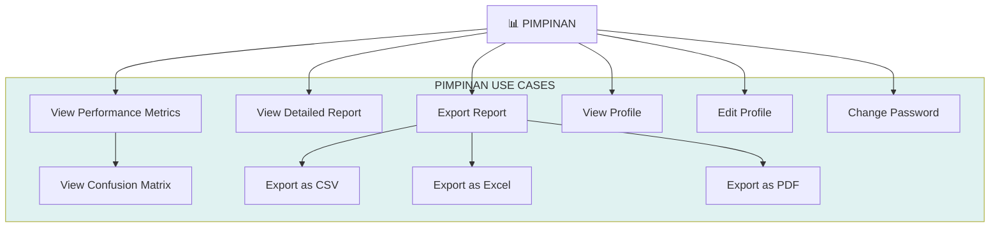
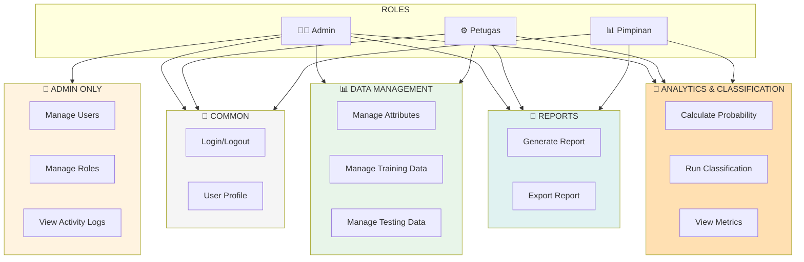
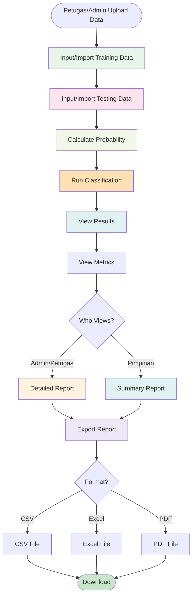
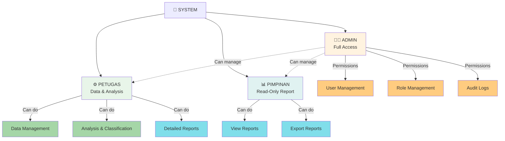

# USE CASE DIAGRAM CODE - Sistem Klasifikasi Penerima Bantuan Subsidi Listrik

## 1. USE CASE DIAGRAM - COMPLETE SYSTEM WITH 3 ROLES

```mermaid
graph TB
    subgraph Roles["👥 ACTORS/ROLES"]
        Admin["👨‍💼 Admin"]
        Petugas["⚙️ Petugas"]
        Pimpinan["📊 Pimpinan"]
    end

    subgraph UC_Auth["🔐 AUTHENTICATION"]
        UC_Register["Register"]
        UC_Login["Login"]
        UC_Logout["Logout"]
        UC_ForgotPass["Forgot Password"]
        UC_ResetPass["Reset Password"]
    end

    subgraph UC_AdminFeatures["👨‍💼 ADMIN MANAGEMENT"]
        UC_ManageUsers["Manage Users"]
        UC_ViewUsers["View User List"]
        UC_AddUser["Add User"]
        UC_EditUser["Edit User"]
        UC_ToggleStatus["Toggle User Status"]
        UC_DeleteUser["Delete User"]
        UC_ManageRoles["Manage Roles"]
        UC_UpdatePermissions["Update Permissions"]
        UC_ViewLogs["View Activity Logs"]
        UC_SearchLogs["Search Activity Logs"]
        UC_FilterLogs["Filter Activity Logs"]
        UC_ExportLogs["Export Activity Logs"]
    end

    subgraph UC_Atribut["🏷️ ATTRIBUTE MANAGEMENT"]
        UC_ManageAttr["Manage Attributes"]
        UC_AddAttr["Add Attribute"]
        UC_EditAttr["Edit Attribute"]
        UC_DeleteAttr["Delete Attribute"]
        UC_ManageValues["Manage Attribute Values"]
    end

    subgraph UC_TrainingData["📚 TRAINING DATA"]
        UC_ViewTraining["View Training Data"]
        UC_InputTraining["Input Training Data"]
        UC_ImportTraining["Import Training Data"]
        UC_DownloadTemplate["Download Template"]
        UC_ExportTraining["Export Training Data"]
        UC_ClearTraining["Clear Training Data"]
        UC_CountTraining["View Data Count"]
    end

    subgraph UC_TestingData["🧪 TESTING DATA"]
        UC_ViewTesting["View Testing Data"]
        UC_InputTesting["Input Testing Data"]
        UC_ImportTesting["Import Testing Data"]
        UC_ExportTesting["Export Testing Data"]
        UC_ClearTesting["Clear Testing Data"]
        UC_CountTesting["View Data Count"]
    end

    subgraph UC_Probability["🎲 PROBABILITY"]
        UC_CalcProb["Calculate Probability"]
        UC_ViewProb["View Probability"]
        UC_ResetProb["Reset Probability"]
    end

    subgraph UC_Classification["🤖 CLASSIFICATION"]
        UC_RunClass["Run Classification"]
        UC_ViewClass["View Classification Results"]
        UC_DetailClass["View Classification Detail"]
        UC_ExportClass["Export Classification"]
        UC_ResetClass["Reset Classification"]
    end

    subgraph UC_Reports["📊 REPORTS & ANALYTICS"]
        UC_ViewMetrics["View Performance Metrics"]
        UC_ConfMatrix["View Confusion Matrix"]
        UC_ViewReport["View Detailed Report"]
        UC_ExportReport["Export Report"]
        UC_ExportCSV["Export as CSV"]
        UC_ExportExcel["Export as Excel"]
        UC_ExportPDF["Export as PDF"]
    end

    subgraph UC_Profile["👤 USER PROFILE"]
        UC_ViewProfile["View Profile"]
        UC_EditProfile["Edit Profile"]
        UC_ChangePassword["Change Password"]
        UC_DeleteAccount["Delete Account"]
    end

    %% AUTHENTICATION - All roles can access
    Admin --> UC_Login
    Petugas --> UC_Login
    Pimpinan --> UC_Login

    Admin --> UC_Logout
    Petugas --> UC_Logout
    Pimpinan --> UC_Logout

    Admin --> UC_ForgotPass
    Petugas --> UC_ForgotPass
    Pimpinan --> UC_ForgotPass

    %% ADMIN FEATURES - Only Admin
    Admin --> UC_ManageUsers
    Admin --> UC_ManageRoles
    Admin --> UC_ViewLogs

    UC_ManageUsers --> UC_ViewUsers
    UC_ManageUsers --> UC_AddUser
    UC_ManageUsers --> UC_EditUser
    UC_ManageUsers --> UC_ToggleStatus
    UC_ManageUsers --> UC_DeleteUser

    UC_ManageRoles --> UC_UpdatePermissions
    UC_ViewLogs --> UC_SearchLogs
    UC_ViewLogs --> UC_FilterLogs
    UC_ViewLogs --> UC_ExportLogs

    %% ATTRIBUTE MANAGEMENT - Admin & Petugas
    Admin --> UC_ManageAttr
    Petugas --> UC_ManageAttr

    UC_ManageAttr --> UC_AddAttr
    UC_ManageAttr --> UC_EditAttr
    UC_ManageAttr --> UC_DeleteAttr
    UC_ManageAttr --> UC_ManageValues

    %% TRAINING DATA - Admin & Petugas
    Admin --> UC_ViewTraining
    Admin --> UC_InputTraining
    Admin --> UC_ImportTraining
    Admin --> UC_ExportTraining
    Admin --> UC_ClearTraining
    Admin --> UC_CountTraining
    Admin --> UC_DownloadTemplate

    Petugas --> UC_ViewTraining
    Petugas --> UC_InputTraining
    Petugas --> UC_ImportTraining
    Petugas --> UC_DownloadTemplate
    Petugas --> UC_CountTraining

    %% TESTING DATA - Admin & Petugas
    Admin --> UC_ViewTesting
    Admin --> UC_InputTesting
    Admin --> UC_ImportTesting
    Admin --> UC_ExportTesting
    Admin --> UC_ClearTesting
    Admin --> UC_CountTesting

    Petugas --> UC_ViewTesting
    Petugas --> UC_InputTesting
    Petugas --> UC_ImportTesting
    Petugas --> UC_CountTesting

    %% PROBABILITY - Admin & Petugas
    Admin --> UC_CalcProb
    Admin --> UC_ViewProb
    Admin --> UC_ResetProb

    Petugas --> UC_CalcProb
    Petugas --> UC_ViewProb

    %% CLASSIFICATION - Admin & Petugas
    Admin --> UC_RunClass
    Admin --> UC_ViewClass
    Admin --> UC_DetailClass
    Admin --> UC_ExportClass
    Admin --> UC_ResetClass

    Petugas --> UC_RunClass
    Petugas --> UC_ViewClass
    Petugas --> UC_DetailClass
    Petugas --> UC_ExportClass

    %% REPORTS - Admin, Petugas & Pimpinan
    Admin --> UC_ViewMetrics
    Admin --> UC_ViewReport
    Admin --> UC_ExportReport

    Petugas --> UC_ViewMetrics
    Petugas --> UC_ViewReport
    Petugas --> UC_ExportReport

    Pimpinan --> UC_ViewMetrics
    Pimpinan --> UC_ViewReport
    Pimpinan --> UC_ExportReport

    UC_ViewMetrics --> UC_ConfMatrix
    UC_ExportReport --> UC_ExportCSV
    UC_ExportReport --> UC_ExportExcel
    UC_ExportReport --> UC_ExportPDF

    %% USER PROFILE - All roles
    Admin --> UC_ViewProfile
    Admin --> UC_EditProfile
    Admin --> UC_ChangePassword

    Petugas --> UC_ViewProfile
    Petugas --> UC_EditProfile
    Petugas --> UC_ChangePassword

    Pimpinan --> UC_ViewProfile
    Pimpinan --> UC_EditProfile
    Pimpinan --> UC_ChangePassword

    style UC_Auth fill:#e1f5fe
    style UC_AdminFeatures fill:#fff3e0
    style UC_Atribut fill:#f3e5f5
    style UC_TrainingData fill:#e8f5e9
    style UC_TestingData fill:#fce4ec
    style UC_Probability fill:#f1f8e9
    style UC_Classification fill:#ffe0b2
    style UC_Reports fill:#e0f2f1
    style UC_Profile fill:#f5f5f5
```



---

## 2. USE CASE DIAGRAM - BY ROLE (ADMIN)

```mermaid
graph TB
    Admin["👨‍💼 ADMIN"]

    subgraph UC_Admin["ADMIN USE CASES"]
        UC_ManageUsers["Manage Users"]
        UC_ViewUsers["View User List"]
        UC_AddUser["Add User"]
        UC_EditUser["Edit User"]
        UC_ToggleStatus["Toggle Status"]
        UC_ManageRoles["Manage Roles"]
        UC_ViewLogs["View Activity Logs"]
        UC_ManageAttr["Manage Attributes"]
        UC_ViewTrain["View Training Data"]
        UC_InputTrain["Input Training Data"]
        UC_ImportTrain["Import Training"]
        UC_ExportTrain["Export Training"]
        UC_ClearTrain["Clear Training"]
        UC_ViewTest["View Testing Data"]
        UC_InputTest["Input Testing Data"]
        UC_ImportTest["Import Testing"]
        UC_ExportTest["Export Testing"]
        UC_ClearTest["Clear Testing"]
        UC_CalcProb["Calculate Probability"]
        UC_ResetProb["Reset Probability"]
        UC_RunClass["Run Classification"]
        UC_ViewClass["View Results"]
        UC_DetailClass["View Detail"]
        UC_ExportClass["Export Results"]
        UC_ResetClass["Reset Classification"]
        UC_ViewMetrics["View Metrics"]
        UC_ViewReport["View Reports"]
        UC_ExportReport["Export Report"]
        UC_ViewProfile["View Profile"]
        UC_EditProfile["Edit Profile"]
        UC_ChangePass["Change Password"]
    end

    Admin --> UC_ManageUsers
    Admin --> UC_ManageRoles
    Admin --> UC_ViewLogs
    Admin --> UC_ManageAttr
    Admin --> UC_ViewTrain
    Admin --> UC_InputTrain
    Admin --> UC_ImportTrain
    Admin --> UC_ExportTrain
    Admin --> UC_ClearTrain
    Admin --> UC_ViewTest
    Admin --> UC_InputTest
    Admin --> UC_ImportTest
    Admin --> UC_ExportTest
    Admin --> UC_ClearTest
    Admin --> UC_CalcProb
    Admin --> UC_ResetProb
    Admin --> UC_RunClass
    Admin --> UC_ViewClass
    Admin --> UC_DetailClass
    Admin --> UC_ExportClass
    Admin --> UC_ResetClass
    Admin --> UC_ViewMetrics
    Admin --> UC_ViewReport
    Admin --> UC_ExportReport
    Admin --> UC_ViewProfile
    Admin --> UC_EditProfile
    Admin --> UC_ChangePass

    UC_ManageUsers --> UC_ViewUsers
    UC_ManageUsers --> UC_AddUser
    UC_ManageUsers --> UC_EditUser
    UC_ManageUsers --> UC_ToggleStatus

    UC_ViewLogs --> UC_SearchLogs["Search"]
    UC_ViewLogs --> UC_FilterLogs["Filter"]

    style UC_Admin fill:#fff3e0
```



---

## 3. USE CASE DIAGRAM - BY ROLE (PETUGAS)

```mermaid
graph TB
    Petugas["⚙️ PETUGAS"]

    subgraph UC_Petugas["PETUGAS USE CASES"]
        UC_ManageAttr["Manage Attributes"]
        UC_ViewTrain["View Training Data"]
        UC_InputTrain["Input Training Data"]
        UC_ImportTrain["Import Training"]
        UC_DownloadTemplate["Download Template"]
        UC_CountTrain["View Data Count"]
        UC_ViewTest["View Testing Data"]
        UC_InputTest["Input Testing Data"]
        UC_ImportTest["Import Testing"]
        UC_CountTest["View Data Count"]
        UC_CalcProb["Calculate Probability"]
        UC_ViewProb["View Probability"]
        UC_RunClass["Run Classification"]
        UC_ViewClass["View Results"]
        UC_DetailClass["View Detail"]
        UC_ExportClass["Export Results"]
        UC_ViewMetrics["View Metrics"]
        UC_ViewReport["View Reports"]
        UC_ExportReport["Export Report"]
        UC_ViewProfile["View Profile"]
        UC_EditProfile["Edit Profile"]
        UC_ChangePass["Change Password"]
    end

    Petugas --> UC_ManageAttr
    Petugas --> UC_ViewTrain
    Petugas --> UC_InputTrain
    Petugas --> UC_ImportTrain
    Petugas --> UC_DownloadTemplate
    Petugas --> UC_CountTrain
    Petugas --> UC_ViewTest
    Petugas --> UC_InputTest
    Petugas --> UC_ImportTest
    Petugas --> UC_CountTest
    Petugas --> UC_CalcProb
    Petugas --> UC_ViewProb
    Petugas --> UC_RunClass
    Petugas --> UC_ViewClass
    Petugas --> UC_DetailClass
    Petugas --> UC_ExportClass
    Petugas --> UC_ViewMetrics
    Petugas --> UC_ViewReport
    Petugas --> UC_ExportReport
    Petugas --> UC_ViewProfile
    Petugas --> UC_EditProfile
    Petugas --> UC_ChangePass

    style UC_Petugas fill:#e8f5e9
```



---

## 4. USE CASE DIAGRAM - BY ROLE (PIMPINAN)



---

## 5. USE CASE DIAGRAM - FEATURE MODULES (DETAILED)



---

## 6. USE CASE SEQUENCE - DATA INPUT TO REPORT GENERATION



---

## 7. PERMISSION MATRIX - ROLE vs FEATURES

```
┌────────────────────────────────────────────────────────────────┐
│         PERMISSION MATRIX: ROLE vs FEATURES                     │
├─────────────────────────────────┬────────┬─────────┬───────────┤
│ FEATURE                         │ Admin  │ Petugas │ Pimpinan  │
├─────────────────────────────────┼────────┼─────────┼───────────┤
│ LOGIN/LOGOUT                    │   ✓    │    ✓    │     ✓     │
│ VIEW PROFILE                    │   ✓    │    ✓    │     ✓     │
│ EDIT PROFILE                    │   ✓    │    ✓    │     ✓     │
│ CHANGE PASSWORD                 │   ✓    │    ✓    │     ✓     │
├─────────────────────────────────┼────────┼─────────┼───────────┤
│ MANAGE USERS                    │   ✓    │    ✗    │     ✗     │
│ MANAGE ROLES                    │   ✓    │    ✗    │     ✗     │
│ VIEW ACTIVITY LOGS              │   ✓    │    ✗    │     ✗     │
├─────────────────────────────────┼────────┼─────────┼───────────┤
│ MANAGE ATTRIBUTES               │   ✓    │    ✓    │     ✗     │
│ INPUT TRAINING DATA             │   ✓    │    ✓    │     ✗     │
│ IMPORT TRAINING DATA            │   ✓    │    ✓    │     ✗     │
│ EXPORT TRAINING DATA            │   ✓    │    ✗    │     ✗     │
│ CLEAR TRAINING DATA             │   ✓    │    ✗    │     ✗     │
├─────────────────────────────────┼────────┼─────────┼───────────┤
│ INPUT TESTING DATA              │   ✓    │    ✓    │     ✗     │
│ IMPORT TESTING DATA             │   ✓    │    ✓    │     ✗     │
│ EXPORT TESTING DATA             │   ✓    │    ✗    │     ✗     │
│ CLEAR TESTING DATA              │   ✓    │    ✗    │     ✗     │
├─────────────────────────────────┼────────┼─────────┼───────────┤
│ CALCULATE PROBABILITY           │   ✓    │    ✓    │     ✗     │
│ VIEW PROBABILITY                │   ✓    │    ✓    │     ✗     │
│ RESET PROBABILITY               │   ✓    │    ✗    │     ✗     │
├─────────────────────────────────┼────────┼─────────┼───────────┤
│ RUN CLASSIFICATION              │   ✓    │    ✓    │     ✗     │
│ VIEW CLASSIFICATION RESULTS     │   ✓    │    ✓    │     ✗     │
│ VIEW CLASSIFICATION DETAIL      │   ✓    │    ✓    │     ✗     │
│ EXPORT CLASSIFICATION           │   ✓    │    ✓    │     ✗     │
│ RESET CLASSIFICATION            │   ✓    │    ✗    │     ✗     │
├─────────────────────────────────┼────────┼─────────┼───────────┤
│ VIEW PERFORMANCE METRICS        │   ✓    │    ✓    │     ✓     │
│ VIEW CONFUSION MATRIX           │   ✓    │    ✓    │     ✓     │
│ VIEW DETAILED REPORT            │   ✓    │    ✓    │     ✓     │
│ EXPORT REPORT (CSV/Excel/PDF)   │   ✓    │    ✓    │     ✓     │
└─────────────────────────────────┴────────┴─────────┴───────────┘
```

---

## 8. USE CASE TEXT SPECIFICATION

### UC-001: Manage Users (Admin Only)

**Actor:** Admin  
**Precondition:** Admin logged in and has manage_users permission  
**Trigger:** Admin clicks "Manage Users" menu

**Main Flow:**
1. System displays user list with pagination
2. Admin can search by name or email
3. Admin can filter by role
4. Admin can view user details
5. Admin can edit user (name, email, role)
6. Admin can toggle user status (active/inactive)
7. System logs all changes to activity log

**Postcondition:** User data updated, activity logged

**Alternative Flow:**
- A1: Email already exists → Display error
- A2: Cannot deactivate own account → Display warning
- A3: Validation error → Display form error

---

### UC-002: Manage Attributes (Admin & Petugas)

**Actor:** Admin, Petugas  
**Precondition:** User logged in and has manage_attributes permission  
**Trigger:** User clicks "Manage Attributes" menu

**Main Flow:**
1. System displays attribute list
2. User can add new attribute (name, type, description)
3. User can edit existing attribute
4. User can delete attribute
5. User can manage attribute values (for categorical)
6. System validates input

**Postcondition:** Attribute data managed in database

**Constraints:**
- Attribute name must be unique
- Cannot delete attribute if used in data

---

### UC-003: Input/Import Training Data (Admin & Petugas)

**Actor:** Admin, Petugas  
**Precondition:** User logged in, attributes already defined  
**Trigger:** User selects "Input Training Data" or "Import Training Data"

**Main Flow:**
1. User chooses input method (manual or import)

**Manual Input:**
1. User fills form with customer data
2. User selects attribute values
3. System validates data
4. System saves to training_data table

**Import from File:**
1. User uploads Excel/CSV file
2. System validates file format
3. System maps columns to attributes
4. System checks for duplicates
5. System imports data
6. System displays summary

**Postcondition:** Training data stored in database

---

### UC-004: Calculate Probability (Admin & Petugas)

**Actor:** Admin, Petugas  
**Precondition:** Training data exists and not empty  
**Trigger:** User clicks "Calculate Probability" button

**Main Flow:**
1. System checks if training data exists
2. System calculates P(Layak) and P(Tidak Layak)
3. For each attribute, calculate likelihood
4. System stores results in probability table
5. System displays summary
6. System logs action

**Postcondition:** Probability table populated, ready for classification

**Error Handling:**
- If training data empty → Error: "Upload training data first"
- If probability exists → Ask for overwrite confirmation

---

### UC-005: Run Classification (Admin & Petugas)

**Actor:** Admin, Petugas  
**Precondition:** Probability calculated, testing data exists  
**Trigger:** User clicks "Run Classification" button

**Main Flow:**
1. System checks prerequisites
2. For each testing record:
   a. Get attribute values
   b. Calculate posterior probability
   c. Compare P(Layak) vs P(Tidak Layak)
   d. Determine predicted class
   e. Calculate confidence score
3. Store results in classification table
4. Calculate metrics (accuracy, precision, recall)
5. Display results

**Postcondition:** Classification results stored, metrics calculated

---

### UC-006: View Reports (Admin, Petugas & Pimpinan)

**Actor:** Admin, Petugas, Pimpinan  
**Precondition:** Classification completed  
**Trigger:** User clicks "View Reports" or "Performance Metrics"

**Main Flow:**
1. System retrieves classification results
2. System calculates confusion matrix
3. System displays:
   - Accuracy
   - Precision
   - Recall
   - F1-Score
   - Confusion Matrix

**Postcondition:** Report displayed to user

**Role-Specific:**
- Admin/Petugas: Can see detailed data
- Pimpinan: Can see summary only

---

### UC-007: Export Report (Admin, Petugas & Pimpinan)

**Actor:** Admin, Petugas, Pimpinan  
**Precondition:** Report generated  
**Trigger:** User selects export format

**Main Flow:**
1. User selects format: CSV, Excel, or PDF
2. System generates file
3. System triggers download
4. File downloaded to user's computer

**Postcondition:** Report file downloaded

---

## 9. SYSTEM ROLE HIERARCHY



---

## 10. COMPLETE USE CASE TABLE

| No | Use Case | Admin | Petugas | Pimpinan | Status |
|----|----------|-------|---------|----------|--------|
| 1 | Login | ✓ | ✓ | ✓ | Required |
| 2 | Logout | ✓ | ✓ | ✓ | Required |
| 3 | Manage Users | ✓ | ✗ | ✗ | Admin Only |
| 4 | Manage Roles | ✓ | ✗ | ✗ | Admin Only |
| 5 | View Activity Logs | ✓ | ✗ | ✗ | Admin Only |
| 6 | Manage Attributes | ✓ | ✓ | ✗ | Data Mgmt |
| 7 | View Training Data | ✓ | ✓ | ✗ | Data Mgmt |
| 8 | Input Training Data | ✓ | ✓ | ✗ | Data Mgmt |
| 9 | Import Training Data | ✓ | ✓ | ✗ | Data Mgmt |
| 10 | Export Training Data | ✓ | ✗ | ✗ | Data Mgmt |
| 11 | Clear Training Data | ✓ | ✗ | ✗ | Data Mgmt |
| 12 | View Testing Data | ✓ | ✓ | ✗ | Data Mgmt |
| 13 | Input Testing Data | ✓ | ✓ | ✗ | Data Mgmt |
| 14 | Import Testing Data | ✓ | ✓ | ✗ | Data Mgmt |
| 15 | Export Testing Data | ✓ | ✗ | ✗ | Data Mgmt |
| 16 | Clear Testing Data | ✓ | ✗ | ✗ | Data Mgmt |
| 17 | Calculate Probability | ✓ | ✓ | ✗ | Analysis |
| 18 | View Probability | ✓ | ✓ | ✗ | Analysis |
| 19 | Reset Probability | ✓ | ✗ | ✗ | Analysis |
| 20 | Run Classification | ✓ | ✓ | ✗ | Analysis |
| 21 | View Classification | ✓ | ✓ | ✗ | Analysis |
| 22 | Export Classification | ✓ | ✓ | ✗ | Analysis |
| 23 | Reset Classification | ✓ | ✗ | ✗ | Analysis |
| 24 | View Metrics | ✓ | ✓ | ✓ | Reports |
| 25 | View Report | ✓ | ✓ | ✓ | Reports |
| 26 | Export Report | ✓ | ✓ | ✓ | Reports |
| 27 | View Profile | ✓ | ✓ | ✓ | Required |
| 28 | Edit Profile | ✓ | ✓ | ✓ | Required |
| 29 | Change Password | ✓ | ✓ | ✓ | Required |

---

## SUMMARY

**Total Use Cases: 29**

**By Role:**
- **Admin:** 29 use cases (Full system access)
- **Petugas:** 22 use cases (Data management + analysis)
- **Pimpinan:** 7 use cases (Reports only)

**By Feature:**
- Authentication: 3 use cases
- Admin Management: 5 use cases
- Attribute Management: 1 use case
- Training Data: 6 use cases
- Testing Data: 6 use cases
- Probability: 3 use cases
- Classification: 5 use cases

*Use case diagram ini menggambarkan seluruh fitur dengan role-based access control untuk Admin, Petugas, dan Pimpinan*
